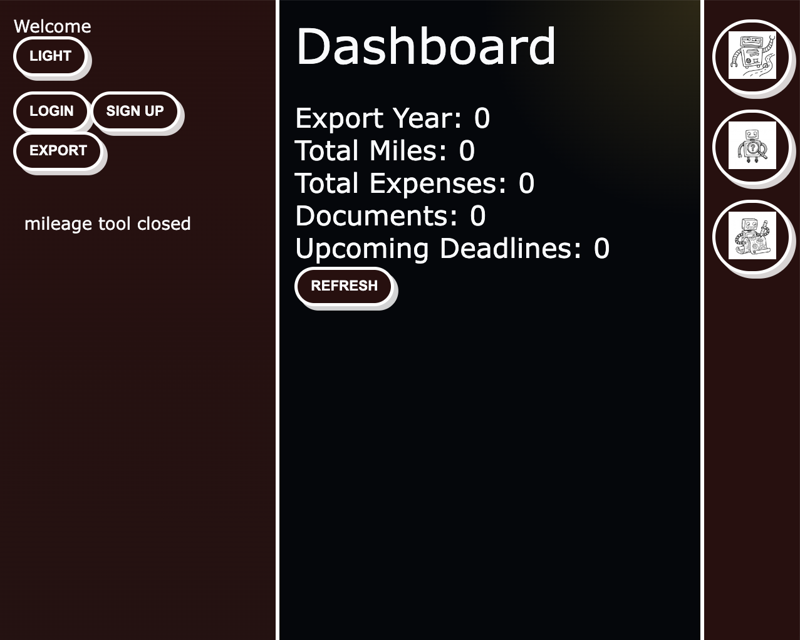
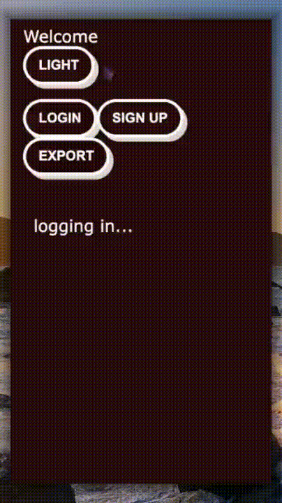
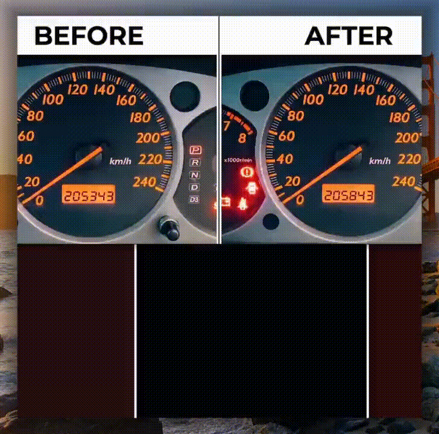
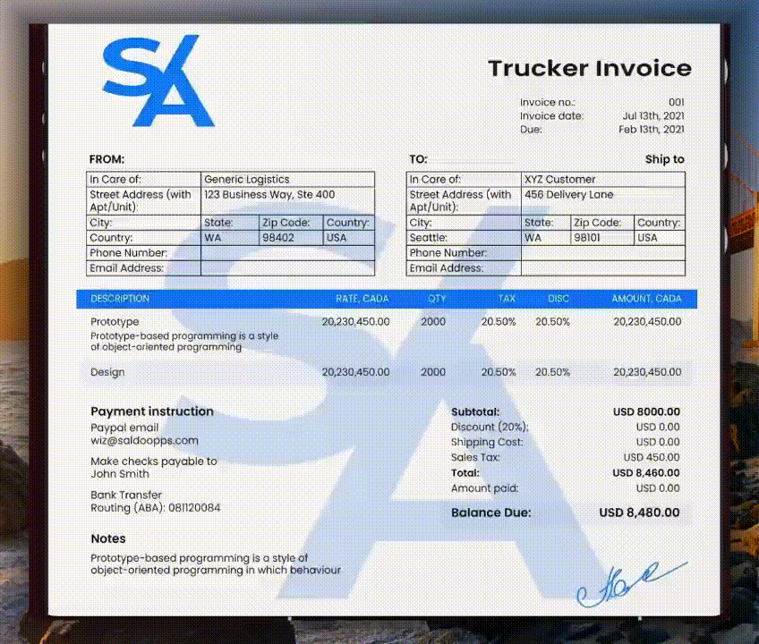
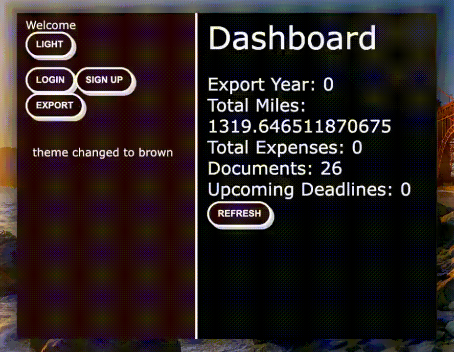

# TrucktimeLOGSYNC

TrucktimeLOGSYNC is an utility app whose purpose is to provide a truckers enviornment list of tools, with logging, miles calculator, display tax related notifications and turn their data into insightful summaries.



## App summary:

### 1) accounts
- accounts act as entry point to the users personal data.
NOTE: Demo account seeded on startup (`demo` / `demo`)

<div style="display: flex;">
  <div class="column" style="flex: 33.33%; padding: 5px;">
    
  </div>
  <div class="column" style="flex: 33.33%; padding: 5px;">
    
  </div>
</div>

### 2) manual mileage log
- manually log miles by providing starting and ending mileage log
- clear or delete previous mileage records



### 3) automatic mileage log
- requires a document/receipt with clear source and destination addresses
- deterministically processes the document for an autofill pre-fill step
- finally OSRM server output is logged and displayed on the dashboard



### 5) export
- Exports dashboard-style JSON via save dialog (`board:exportJsonToFile`)



## Architecture

```text
src/
  main/
    index.ts                 Electron app lifecycle + DB initialization
    ipc-handlers.ts          IPC routes for accounts, mileage, OCR, export
    database/                SQLite connection + repositories
  preload/
    index.ts                 Safe API bridge to renderer
  renderer/src/
    main.tsx                 Main React UI and tool shell
    ipc.ts                   Renderer IPC wrappers
    components/              Accounts, Mileage, Document, etc.
  shared/
    types.ts                 Shared TypeScript interfaces
```

## Requirements

Base app:
- Node.js + npm
- consistant python exec path

For OCR features:
- `tesseract` available on system PATH
- Python 3 environment with the receipt tool dependencies (`cv2`, `numpy`, `Pillow`, `transformers`, `torch`, `tqdm`)

If OCR dependencies are missing, account and mileage features can still run.

For OSRM features:
- consult the `DISTANCE-DOC.md` file at root for installation and setup of Nominatim and OSRM for the project.
- modify the fields in main "your x here" inside the `distanceProcesessing.py` file to hook everything up

NOTE: it is recommended that the `*.osrm` file is moved to the distanceTool folder, after installation.

## Development

```bash
npm install
npm run dev
```

## Scripts

```bash
npm run dev
npm run lint
npm run test
npm run build
```
